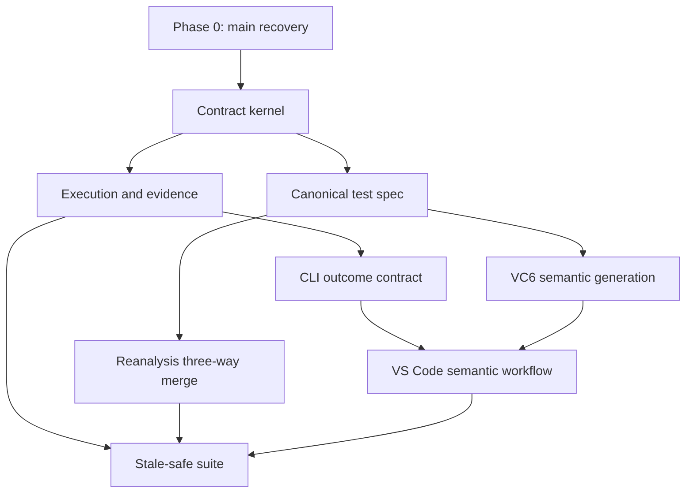

# Unit Test Runner Hardening Master Implementation Plan

> **For agentic workers:** REQUIRED SUB-SKILL: Use superpowers:subagent-driven-development (recommended) or superpowers:executing-plans to implement this plan task-by-task. Steps use checkbox (`- [ ]`) syntax for tracking.

**Goal:** Turn the current VC6 test-preparation alpha into a trustworthy, executable, reviewable, and maintainable unit-test suite without silently changing test meaning or reporting false success.

**Architecture:** Recover `main` first, then establish versioned machine contracts and immutable run evidence. Build VC6 semantic generation on that contract, move the VS Code adapter to one workspace-scoped execution model, and finally make reanalysis and suite execution revision-aware and stale-safe. Each phase is a separate reviewable plan and must pass its own gate before the next phase merges.

**Tech Stack:** Python 3.12, standard-library `unittest`, JSON Schema Draft 2020-12 with `jsonschema`, TypeScript 5.4, VS Code 1.85 Extension API, Node.js 20, generated C90/CP932/CRLF, VC6 DSP/DSW/NMAKE, GitHub Actions on Windows.

## Global Constraints

- Product C/H/DSW/DSP/LIB files are read-only; only generated workspace copies may be rewritten.
- Generated C remains C90-compatible, CP932-encoded, and CRLF-terminated.
- A value that cannot be represented faithfully must become `blocked` or `review_required`; it must never silently become `0`, `int`, or a non-NULL pointer.
- `failed`, `blocked`, `timed_out`, `cancelled`, `inconclusive`, and `planned` are distinct states.
- All layers use one terminal `RunOutcome`: `planned`, `passed`, `failed`, `blocked`, `inconclusive`, `cancelled`, `timed_out`, or `error`. Lifecycle (`queued`, `running`, `finished`) is recorded separately.
- Execution, evidence, workflow progress, and process exit codes must report the same semantic result.
- Machine JSON uses stable, non-localized enum values; Japanese labels belong in renderers and the VS Code UI.
- CSV and Markdown are generated views. `test_spec.json` and `review_decisions.json` are the only human-editable machine contracts.
- Existing merged work for DSP/LIB linked functions, dependency policy dispatch, settings-panel persistence, terminology consistency, and process-tree termination is retained and regression-tested rather than reimplemented.
- No phase may weaken a failing test merely to obtain a green build; stale expectations may change only when a safer replacement contract is asserted.

---

## Baseline

**GitHub baseline:** `ec85f0fe81a486a5ce4bba67be79c3a4624a7763` (`main`, 2026-07-11).

The review baseline `7f050f4` has moved forward. The following work is already on `main`:

- DSP/DSW and COFF `.lib` linked-function resolution.
- Per-call `real` / `stub` / `auto` dependency policies and collision-safe dispatchers.
- Referenced-header build workspaces and VC6 response-file handling.
- Settings-panel expansion persistence.
- Timeout-triggered process-tree termination.
- Simple/detailed workflow terminology alignment.

The current merge is not executable as a Python product:

- `build_workspace_generator.py` imports `unit_test_runner.build.dependency_rewriter`, but that source file is absent.
- `.gitignore` contains unanchored `build/`, which ignores `src/unit_test_runner/build/` additions and is the likely integration cause.
- Python discovery: 201 tests, 31 errors, 23 failures, 1 skip; most are cascading import failures.
- Diagnostic reconstruction of the missing module discovers 250 tests with 6 failures, 1 platform-specific error, and 1 skip.
- VS Code: TypeScript compiles; 43 tests run, 38 pass and 5 fail on Linux because Windows paths are interpreted with POSIX path semantics.
- `quickExtension.ts` registers `unitTestRunner.openGeneratedTestSource` twice and overrides the selected Quick profile.

Therefore, Phase 0 is a stop-the-line recovery, not an optional cleanup.

---

## Chosen Delivery Strategy

Use a **vertical hardening sequence**.

| Approach | Decision | Reason |
|---|---|---|
| Patch only current red tests | Rejected | Restores appearance but preserves false PASS/evidence and semantic value loss. |
| Big-bang rewrite | Rejected | Too difficult to review against legacy VC6 behavior; high regression risk. |
| Recover, contract, semantic generation, adapter, regression platform | **Adopted** | Each phase creates a usable invariant and a clear rollback/review boundary. |

---

## Phase Plans and Merge Gates

### Phase 0: Recover `main` and establish a trustworthy gate

Plan: [2026-07-11-unit-test-runner-phase-0-main-recovery.md](2026-07-11-unit-test-runner-phase-0-main-recovery.md)

Delivers:

- Restored dependency call rewriter and corrected ignore rules.
- One VS Code activation entry and exactly-once command registration.
- Stable Windows-path handling in platform-independent unit tests.
- Resolution of known contract drift: aggregate typedef initialization, typedef return headers, localization, runner-output semantics, extension manifest.
- Correct file-scope object-definition detection and a real host compile/link fixture.
- Immediate nonzero CLI exit for failed, blocked, timed-out, or inconclusive test runs.
- Independent Python and VS Code CI jobs so one failure cannot hide the other.

Gate G0:

```text
CLI import succeeds
Python discovery has 0 import errors
Python tests GREEN on Windows
TypeScript compile/tests GREEN on Windows
Dependency-policy end-to-end GREEN
Default fixture host compile/link GREEN
Non-PASS execution cannot return exit 0
```

Relative size: 8 reviewable PRs.

### Phase 1: Versioned contracts, truthful execution, and immutable evidence

Plan: [2026-07-11-unit-test-runner-phase-1-contract-execution-evidence.md](2026-07-11-unit-test-runner-phase-1-contract-execution-evidence.md)

Delivers:

- Contract registry, artifact-specific JSON Schemas, runtime validation, and v0.1 migration.
- A versioned CLI envelope with real artifact references and uniform exit rules.
- Immutable `runs/<run_id>` execution history.
- Non-destructive evidence preparation and semantic readiness.
- Canonical `test_spec.json` and persisted `review_decisions.json`.
- Deterministic artifact hashing, validated traceability, and removal/implementation of dead public options.

Gate G1:

```text
prepare-evidence changes no execution/log bytes
PASS is the only executed test result with exit 0
All returned artifacts exist and match their hash
Schema-invalid or stale artifacts cannot advance readiness
CSV/Markdown saves cannot approve a test spec
```

Relative size: 8 reviewable PRs; contract kernel precedes execution and test-spec tracks.

### Phase 2: VC6-semantic test generation

Plan: [2026-07-11-unit-test-runner-phase-2-vc6-semantic-generation.md](2026-07-11-unit-test-runner-phase-2-vc6-semantic-generation.md)

Delivers:

- Source-specific effective DSP compile contexts.
- Configuration-aware preprocessing and inactive-region masking.
- Shared type resolver and same-translation-unit bridges for static targets/state.
- Typed inputs, pointer fixtures, reviewed oracles, and exact stub assertions.
- Real host-compiler end-to-end fixtures and a release-required self-hosted VC6 acceptance lane.
- A content-keyed VC6 workspace index with invalidation and structured progress.

Gate G2:

```text
No generated `0 /* candidate */`
No generated `TBD_EXPECTED_RETURN_INT`
No tautological stub call-count assertion
No aggregate/typedef-to-int ABI fallback
Static target and representative aggregate/pointer tests build and run
Selected DSP configuration is reproduced per source file
```

Relative size: 9 reviewable PRs.

### Phase 3: Workspace-scoped VS Code workflow and execution control

Plan: [2026-07-11-unit-test-runner-phase-3-vscode-workflow.md](2026-07-11-unit-test-runner-phase-3-vscode-workflow.md)

Delivers:

- One extension-wide execution coordinator with user cancellation and streaming progress.
- Workspace-scoped target/run identity; no global last-workspace execution.
- Dirty-file, multi-root, DSW/CLI/output safety preflight.
- Workflow state derived from validated artifact/review/execution states rather than file existence.
- Canonical test-spec/review UI and Extension Host integration coverage.

Gate G3:

```text
At most one CLI process per target workspace
Cancel and timeout leave 0 child processes
Workspace B cannot run Workspace A output
Failed/not-run artifacts never appear complete
Keyboard-only workflow and Extension Host activation tests GREEN
```

Relative size: 7 reviewable PRs.

### Phase 4: Reanalysis and durable regression suites

Plan: [2026-07-11-unit-test-runner-phase-4-reanalysis-suite.md](2026-07-11-unit-test-runner-phase-4-reanalysis-suite.md)

Delivers:

- Semantic coverage/test IDs independent of array order.
- Base/generated/manual three-way merge with explicit conflicts.
- Build-context and dependency-aware conservative regression selection.
- Portable suite manifests, stale-input prevention, case-filtered execution, and immutable suite history.
- Suite management for tags, enabled state, removal, filtering, and failure drill-down.

Gate G4:

```text
Prepending coverage does not renumber existing cases
Every new required coverage item appears exactly once
Manual oracle and dependency overrides survive reanalysis
Stale binaries cannot execute by default
Moving a suite tree preserves its entries
Any Not GREEN entry produces a nonzero suite result
```

Relative size: 6 reviewable PRs.

---

## Dependency Graph



The only permitted parallel tracks are:

- Phase 1 execution/evidence and canonical test spec after the contract kernel.
- Phase 2 DSP/preprocessor work and type/value work after schemas stabilize.
- Phase 3 UI rendering/accessibility and execution coordinator after the CLI envelope stabilizes.

---

## Branch and Review Policy

- Start each child plan from the commit that passed the previous phase gate.
- Use one branch per independently rejectable task; avoid a single cross-phase branch.
- Every PR contains a failing regression test first, the minimum implementation, and updated contract documentation.
- Merge dependency-sensitive PRs in plan order; do not squash unrelated phase work together.
- Do not label a PR verified when only focused tests ran. State focused and repository-wide results separately.
- The final release branch requires Windows GitHub Actions plus real host-compiler E2E. VC6-native acceptance may run on a self-hosted protected runner.

Suggested branch sequence:

```text
fix/main-import-and-ignore-rules
fix/activation-and-command-registry
fix/baseline-contract-drift
feat/contract-kernel
feat/immutable-test-runs
feat/canonical-test-spec-review
feat/vc6-effective-compile-context
feat/vc6-typed-harness
feat/vscode-execution-coordinator
feat/vscode-semantic-workflow
feat/reanalysis-three-way-merge
feat/portable-stale-safe-suite
```

---

## Final Release Gate

- [ ] Python, Node unit, Extension Host, fixture E2E, and packaging checks are all GREEN.
- [ ] Generated C is semantically traceable to an approved test-spec value/oracle ID.
- [ ] Unsupported values and types block before compile; no lossy fallback is emitted.
- [ ] `failed`, `blocked`, `timed_out`, `cancelled`, `inconclusive`, and `error` are non-GREEN in CLI, UI, dossier, and suite.
- [ ] Evidence is immutable, complete, hash-valid, and linked to one run ID.
- [ ] DSP configuration, per-file options, PCH, defines, and linked libraries match the selected VC6 target.
- [ ] Static targets, typedef/aggregate values, pointers/arrays, extern globals, and real/stub mixed dependencies have acceptance fixtures.
- [ ] Review approval records reviewer, time, rationale, artifact revision, and hash; changed artifacts reopen review.
- [ ] Reanalysis cannot lose new coverage or silently overwrite human-owned fields.
- [ ] Suite execution refuses stale inputs and preserves immutable run history.
- [ ] User cancellation and timeout leave no orphan process.
- [ ] Documentation, command labels, CLI behavior, and generated artifacts describe the same workflow.

---

## Plan Execution Handoff

Begin with Phase 0 Task 1 only. After its focused tests pass, run full Python discovery to replace the cascading failure baseline with the actual residual list. Do not start schema or UI refactoring while the CLI cannot import.
